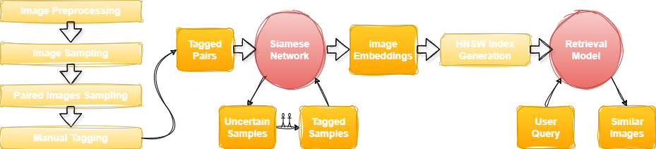

# Image_Search

A project for Data Analysis and Visualization Lab course, implementing a retrieval pipeline for image search using ANN, and tests of the effect of fine-tuning the similarity metric with Active Learning methods.

## Goal

Our project addresses the need of a user searching for real estate to find houses similar in style to her query. 
By fine-tuning an embedding space of images with AL tools and performing approximate nearest-neighbours search, we created a system that efficiently retrieves visually similar houses to enhance user experience.

**Pipeline of the system generation:**

<div style="background-color:white; width:70%; padding:10px; border-radius:10px; align:center">
    
</div>
<p>

## Installation

The required packages for the project can be imported by creating a new environment with the `environment.yml` file. The environment can be created with the following command:

```bash
conda env create -f environment.yml
```

Or run on the provided Azure Machine for the course, with kernel `azureml_py310_sdkv2 (Python 3.10.15)`.

## Example Usage

To run the full retrieval pipeline, run the 'pipeline.py' script with a desired query image and k value for the top k retrieved images. The script can create the vector database from scratch or load a pre-existing one.

## Datasets

Download the house styles dataset from [Kaggle](https://www.kaggle.com/datasets/kelvingothman/house-typestyle-detection) - to access the `all_images` folder containing the .jpg files.


The expected data configuration is then:
```
|- datasets
    |- house_styles
        |- all_images
        evaluation_paired_labels.csv
        labels.csv
        sampled_labels.csv
        sampled_paired_labels_shuffled.csv
```

The process of creating the paired dataset is described in the `data_tagging.ipynb` notebook.

### Contributed Dataset


Our contribution to the data is in the labeling of pairs of images by similarity, acquired through a combination of automatic and manual labeling. The similarity labels are null, 0 if the houses are in different classes, or 1 through 3 for manually labeled pairs during active learning with 3 being the most similar.

We offer the following data:
- Full paired dataset (all possible pairs of images from sample), with partial labels, is stored in the `sampled_paired_labels_shuffled.csv` file. These labels were used as training and validation data, influenced in selection by the model in the active learning process.
- A blind test set, not influenced by the model selection, is stored in the `active_learning_labels/blind_test.csv` file.
- Lastly, to evaluate the retrieval model, the top k=5 retrieved images of 50 query images were fully tagged to avoid missing relevant pairs. This data is stored in `datasets/house_styles/evaluation_paired_labels.csv`.

For future work with this dataset, be advised of the correlation in the chosen images for the data, and select the relevant files for the task at hand.


## Models

Our approach to an image retrieval pipeline contains two main models: an embedding model and a retrieval model.

### Embedding Model - Siamese Network

The embedding model is a Siamese Network, fine tuned from CLIP embeddings using contrastive loss. The model is part of `active_learning_pipeline.ipynb` and is also shown separately in `siamese_network.py`.

#### Active Learning

The active learning process is implemented in `active_learning_pipeline.ipynb`. The process of active learning - trained model, data samples to tag, and results from each round - is logged in `active_learning_models`, `active_learning_labels`, and `active_learning_results` folders, respectively.

### Retrieval Model - FAISS Index

The retrieval model is based on FAISS, a library for efficient similarity search and clustering of dense vectors. Analysis and comparison of ANN methods are in `ann_evaluation.ipynb`, and saved vector databases for embedded indexes can be found in the `vector_dbs` folder.

## Evaluation

In addition to other results shown in the previous notebooks, the folder `report_results` contains code and figures as shown in the report.
